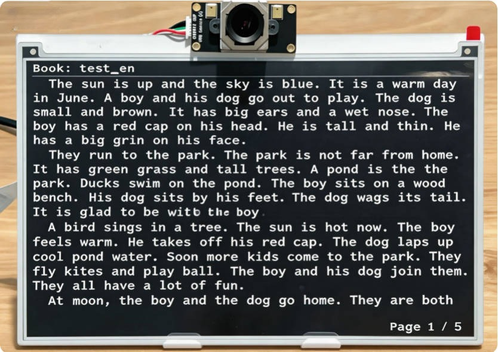

# 墨水屏阅读器

[English](README.md) | 中文

## 项目概述

本项目是一款基于[Quectel Pi H1智能主控板](https://developer.quectel.com/doc/sbc/Quectel-Pi-H1/zh/Applications/Open-Source-Projects/e_ink_reader/e_ink_reader.html)的智能电子墨水屏阅读器。系统结合电子墨水屏低功耗显示特性与基于摄像头的眼动追踪技术，实现了无需手动操作的自然翻页阅读方式。通过检测用户眼球视线变化完成翻页控制，并配合物理按键作为辅助输入，提升系统可靠性。

在显示方面，系统采用局部刷新与分区渲染策略，支持中英文文本的自动排版与连续阅读，同时具备页面记忆与快速唤醒功能，适用于长时间阅读及嵌入式智能终端应用场景。




## 🌟 核心功能特性

| 功能项 | 描述 |
|--------|------|
| **眼动控制翻页** | 通过检测眼球移动方向实现翻页，当观看到阅读器底部时，只需将目光移至屏幕顶部，即可触发翻页操作 |
| **智能息屏** | 检测不到人脸超过设定时间后自动息屏，保护隐私并节省电量 |
| **多语言支持** | 支持纯英文、纯中文（GB2312）、中英混合文本的正确渲染 |
| **自动排版** | 不裁剪字符，自动换行，支持跨页内容延续，首行缩进 |
| **页面记忆** | 支持返回前一页并保证像素级一致，精准记录阅读位置 |
| **多书管理** | 支持物理按键长按切换不同书籍 |
| **高效刷新** | 采用局部刷新技术，减少闪烁并提高刷新速度 |

## 👁️ 眼动控制使用方法

### 启动流程
1. 运行 `./build.sh`，脚本会同时启动眼动追踪和墨水屏显示程序
2. 摄像头自动检测可用设备并开始监测眼部运动
3. 初始化需要 4 秒 —— 此期间请保持正常阅读姿势

### 翻页操作
- **向下翻页**：保持阅读姿势，按正常速度从屏幕顶部往下阅读，当视线到达屏幕底部时将目光移回顶部，即可触发翻页
- **向上翻页**：需通过物理按键操作（短按 KEY2）
- **翻页冷却**：两次翻页间有 1 秒冷却时间，防止误触

### 息屏 / 唤醒功能
- **自动息屏**：检测不到人脸 60 秒后自动发送息屏信号
- **自动唤醒**：重新检测到人脸时自动唤醒屏幕
- **事件清理**：唤醒时清理息屏期间的输入事件，防止误翻页

## ⌨️ 物理按键功能

| 操作 | 按键 | 功能 |
|------|------|------|
| 短按 | KEY1 | 向下翻页 |
| 短按 | KEY2 | 向上翻页 |
| 长按 | KEY1 | 切换到下一本书 |
| 长按 | KEY2 | 切换到上一本书 |

## 🛠️ 系统要求

### 硬件要求
- **主控板**：Quectel Pi H1智能主控板
- **显示屏**：Waveshare 7.5" 黑白电子墨水屏
- **摄像头**：OV5693 USB摄像头（用于眼动追踪）
### 电子墨水屏连接引脚
| EPD 引脚 | BCM2835编码 | Board物理引脚序号 |
|----------|-------------|-------------------|
| VCC      | 3.3V        | 3.3V              |
| GND      | GND         | GND               |
| DIN      | MOSI        | 19                |
| CLK      | SCLK        | 23                |
| CS       | CE0         | 24                |
| DC       | 25          | 22                |
| RST      | 17          | 11                |
| BUSY     | 24          | 18                |
| PWR      | 18          | 12                |
### 软件要求

- 操作系统：Debian 13（Quectel Pi H1 默认系统）
- Python版本：Python 3.9~3.12
- 依赖组件
    - OpenCV-Python == 4.8.1.78
    - MediaPipe == 0.10.9
    - evdev == 1.9.2
    - numpy==1.24.3


## 🚀 完整部署指南

> 一键部署脚本 `deploy.sh` 支持全新系统从零完成所有环境配置，无需手动逐步操作。

### 项目实现

1. 在智能主控板上打开终端，使用git克隆项目代码。

```shell
sudo apt update
sudo apt install -y git
git clone https://github.com/Quectel-Pi/demo-inkscreen-reader.git
```
执行完成后，当前目录下应生成`demo-inkscreen-reader`文件夹。

2. 运行`deploy.sh`部署脚本，终端显示`Deployment complete`则说明部署完成。

```bash
cd demo-inkscreen-reader
sudo chmod 755 deploy.sh
./deploy.sh
```
如果执行`./deploy.sh`过程中报错，或终端未显示"Deployment complete"，请先不要继续执行后续步骤。建议先确认网络连接正常，再返回项目根目录重新执行一次`deploy.sh`。

3. 部署完成后，先输入以下命令重启设备。

```bash
sudo reboot    
```

4. 设备重启后，重新打开终端，在`demo-inkscreen-reader`路径下执行程序。

```bash
cd demo-inkscreen-reader
sudo chmod 755 build.sh
./build.sh
```

### 显示书籍说明

将 `.txt` 文件放入项目的`demo-inkscreen-reader/books/` 目录即可。系统自动识别UTF-8与GB2312编码。

> **提示**：Windows 用户使用记事本 → 另存为 → 编码选 UTF-8 或 ANSI（GB2312）均可。

### 编译说明

EPD 墨水屏驱动使用 C 语言编写，采用 Makefile 构建：

```bash
cd demo-inkscreen-reader/components/e-Paper/Quectel-Pi-H1/c
make clean
make CC=gcc EPD=epd7in5V2
```
编译产物为 `epd` 可执行文件，需以 `sudo` 权限运行（需要访问 GPIO）。


### 配置开机自启动（可选）

项目提供 `setup_autostart.sh`，用于配置系统级 service。

```bash
cd ~/demo-inkscreen-reader
sudo chmod 755 setup_autostart.sh
./setup_autostart.sh
```

服务管理命令：

```bash
sudo systemctl status inkscreen-reader
sudo systemctl restart inkscreen-reader
sudo systemctl stop inkscreen-reader
sudo systemctl disable inkscreen-reader
```

### 字体生成（可选）

如需自定义字体，可使用 `tools/generate_noto_font12cn.py` 从中文字体文件提取指定大小的点阵字库。

## 📁 目录结构

```
demo-inkscreen-reader/
├── README.md                              # 项目说明（英文）
├── README_zh.md                           # 项目说明（中文）
├── build.sh                               # 启动脚本
├── deploy.sh                              # 一键部署脚本
├── setup_autostart.sh                     # 开机自启动脚本
├── requirements.txt                       # Python 依赖列表
├── assets/
│   └── main_reader.jpg                    # 主界面预览图
├── books/                                 # 书籍文件目录
│   ├── test_cn.txt                        # 中文测试书籍
│   └── test_en.txt                        # 英文测试书籍
├── components/
│   └── e-Paper/
│       └── Quectel-Pi-H1/
│           └── c/                         # C 驱动源码
│               ├── epd                    # 编译产物（可执行文件）
│               ├── Makefile
│               ├── examples/
│               │   └── EPD_7in5_V2_reader_txt.c  # 主显示程序
│               ├── lib/                   # 驱动库（Config/GUI/e-Paper/Fonts）
│               └── pic/
│                   └── 2.bmp              # 息屏图片
├── src/
│   └── main.py                            # Python 眼动追踪主程序
└── tools/
    └── generate_noto_font12cn.py          # 字体生成工具
```

## 🔍 故障排除

| 问题 | 解决方案 |
|------|----------|
| 摄像头无法打开 | 检查设备权限，使用 `ls /dev/video*` 确认设备节点存在 |
| 眼动控制无响应 | 检查摄像头是否被其他程序占用，确认MediaPipe安装正确 |
| 屏幕无显示或异常 | 检查SPI连接是否牢固，GPIO配置是否正确 |
| 按键无效 | 使用 `cat /proc/bus/input/devices` 查找event设备并确认权限 |
| 编译失败 | 检查交叉编译工具链是否存在且路径正确 |

## 报告问题
欢迎提交Issue和Pull Request来改进此项目。